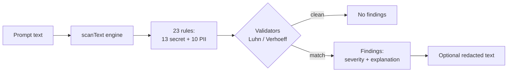

# PromptGuard

> Catch secrets, PII, and runaway token cost in your prompts before they ever reach the language model. Local-first, zero telemetry.

[](https://www.npmjs.com/package/@promptguardapp/mcp)
[](https://www.typescriptlang.org/)
[](https://modelcontextprotocol.io/)
[](./LICENSE)
[](https://nodejs.org/)

PromptGuard is a Model Context Protocol (MCP) server, plus a browser extension and a VS Code extension, that scans developer prompts on your own machine before they are sent anywhere. It flags leaked credentials and personal data, previews token cost, and tightens bloated prompts.

## What it does

Prompts are a quiet exfiltration channel. Developers paste real AWS keys, GitHub tokens, customer emails, and entire SSN-laden support tickets into a chat box, and that text leaves the building the moment they hit send. The same prompts are often padded with filler that burns tokens (and money) on every call.

PromptGuard sits between you and the language model and runs three checks locally, before the prompt is transmitted:

- **Is anything sensitive in here?** Detects 23 patterns of secrets and personally identifiable information, with per-finding explanations and optional redaction.
- **What will this cost?** Counts tokens with the correct tokenizer per model and estimates the dollar cost before you send.
- **Can this be tighter?** Suggests a leaner rewrite (optimize) or aggressively strips tokens (compress), while preserving code blocks.

Every byte of analysis happens on the user's machine. No prompt content is transmitted to any external service.

## Features

### Secret detection (13 patterns)

AWS access key IDs, GitHub classic / fine-grained / OAuth tokens, OpenAI API keys, Anthropic API keys, Stripe live and test secret keys, Slack bot and user tokens, Google API keys, npm access tokens, and PEM-encoded private keys. Each finding carries a severity, a confidence score, and a human-readable explanation of why it matters.

### PII detection (10 patterns)

- **Universal:** email addresses, credit card numbers (Luhn-validated).
- **US:** phone numbers, Social Security Numbers.
- **India:** mobile numbers, Aadhaar (Verhoeff checksum validated), PAN, GSTIN, UPI IDs, and IFSC codes.

Validators cut false positives: a 16-digit number is only flagged as a card if it passes the Luhn check, and a 12-digit number is only flagged as Aadhaar if it passes the Verhoeff checksum.

### Token and cost estimation

Token counts and dollar estimates across Claude (Opus 4.7, Sonnet 4.6, Haiku 4.5) and OpenAI (GPT-4o, GPT-4o-mini), powered by `js-tiktoken`. The correct tokenizer is used per model: `o200k_base` for GPT-4o, `cl100k_base` for older OpenAI models and as a flagged approximation for Claude (which does not publish its tokenizer).

### Prompt optimization and compression

- **optimize_prompt** removes filler, verbose phrases, and hedging, and flags missing structure (no task verb, no output format). It stays silent on prompts that are already concise.
- **compress_prompt** does aggressive token reduction at three levels (light, medium, aggressive), preserving fenced code blocks. Realistic savings are 10 to 25 percent on typical prompts.

### Local-first by design

No backend, no telemetry, no accounts, no analytics SDKs. The MCP server speaks stdio, and the browser extension makes zero network requests of its own. See [Privacy](#privacy).

### Three surfaces, one engine

The same `scanText` detection engine backs all three products:

- **MCP server** for any MCP-compatible client (Claude Desktop, Cursor, Cline, Windsurf, Continue.dev, Goose) and as a Claude Code prompt hook.
- **Browser extension** for inline scanning on Claude.ai, ChatGPT, Gemini, Perplexity, You.com, and Mistral. See [`extension/README.md`](./extension/README.md).
- **VS Code extension** that scans the current document and surfaces findings in the Problems panel. See [`vscode-extension/README.md`](./vscode-extension/README.md).

## How it works

A prompt comes in, the engine runs every rule against it, validators discard false positives, and the result is a verdict: either a clean pass or a list of findings (with an optional redacted copy of the text).



Scans are sub-millisecond in-process, so the check adds no meaningful latency to your workflow. The MCP server exposes the engine (and the cost, optimize, and compress tools) over stdio; the browser and VS Code extensions bundle the very same engine so behavior is identical everywhere.

### MCP tools

The server exposes four tools to any MCP-compatible client:

| Tool | What it does |
|---|---|
| `scan_prompt` | Detects secrets and PII. Returns findings with location, severity, and explanation, plus an optional redacted version (`mode: "warn"` or `"redact"`). |
| `optimize_prompt` | Suggests a tightened rewrite and flags missing structure. Stays silent on already-good prompts. |
| `compress_prompt` | Aggressive token reduction at `light`, `medium`, or `aggressive` levels. Preserves code blocks. |
| `estimate_cost` | Token count and dollar estimate for a given `model`, with an optional `expectedOutputTokens` override. |

(A `ping` health-check tool is also exposed so a client can confirm the server is alive.)

## Install and use

The simplest setup uses `npx`, so there is no manual install.

### Requirements

- Node.js 20 or later
- Any MCP-compatible client speaking the Model Context Protocol over stdio

### Claude Desktop

Edit `~/Library/Application Support/Claude/claude_desktop_config.json` (macOS), or the equivalent path on Windows / Linux:

```json
{
  "mcpServers": {
    "promptguard": {
      "command": "npx",
      "args": ["-y", "@promptguardapp/mcp"]
    }
  }
}
```

Restart Claude Desktop and the PromptGuard tools become available immediately.

### Cursor

Cursor reads MCP servers from `~/.cursor/mcp.json`, with the same config shape:

```json
{
  "mcpServers": {
    "promptguard": {
      "command": "npx",
      "args": ["-y", "@promptguardapp/mcp"]
    }
  }
}
```

### Continue.dev

In `~/.continue/config.json`, add an MCP server entry:

```json
{
  "experimental": {
    "modelContextProtocolServers": [
      {
        "transport": {
          "type": "stdio",
          "command": "npx",
          "args": ["-y", "@promptguardapp/mcp"]
        }
      }
    ]
  }
}
```

### Cline / Windsurf / Goose

These accept the standard MCP stdio config. Add a server entry pointing at `npx -y @promptguardapp/mcp` and you are set.

### If node or npx are not on PATH

Common when Node is installed via nvm. Use absolute paths (run `which npx` to find yours):

```json
{
  "mcpServers": {
    "promptguard": {
      "command": "/absolute/path/to/npx",
      "args": ["-y", "@promptguardapp/mcp"]
    }
  }
}
```

### Using the tools

In any client, ask the model to use a tool by name:

- "Use scan_prompt on this text: ..."
- "Use compress_prompt on this prompt at aggressive level."
- "Use estimate_cost to compare gpt-4o-mini and claude-sonnet-4-6 for this prompt."

The model calls the tool and presents the result inline.

### Claude Code hook (scan every prompt automatically)

If you use [Claude Code](https://docs.claude.com/en/docs/claude-code), install PromptGuard as a `UserPromptSubmit` hook so every prompt you type is scanned before it is sent. No tool call, no per-prompt action. Clean prompts pass through silently; if something is caught, you see an inline warning. The hook never blocks the prompt, it only warns, and you decide whether to retry redacted.

Edit `~/.claude/settings.json` and merge in:

```json
{
  "hooks": {
    "UserPromptSubmit": [
      {
        "hooks": [
          {
            "type": "command",
            "command": "npx --yes --package=@promptguardapp/mcp -- promptguard-hook",
            "timeout": 5
          }
        ]
      }
    ]
  }
}
```

The first prompt triggers `npx` to download and cache the package; after that, each prompt is scanned in roughly 50 ms.

### Browser extension

PromptGuard also ships as a browser extension that scans prompts inline on AI chat sites (Claude.ai, ChatGPT, Gemini, Perplexity, You.com, Mistral). It draws wavy underlines under detected secrets and PII and offers one-click redaction, cost estimation, and prompt optimization. Build it from source and load it unpacked:

```bash
npm install
npm run extension:build
```

Then load the `extension/` directory as an unpacked extension in Chrome (`chrome://extensions`, Developer mode, Load unpacked). Full instructions and architecture are in [`extension/README.md`](./extension/README.md).

### VS Code extension

The VS Code extension scans the active document (and re-scans on save), drawing squiggles under matches and listing them in the Problems panel. Build it from source:

```bash
npm install
npm run vscode:build
```

Then press `F5` in VS Code to launch an Extension Development Host with PromptGuard loaded. Details in [`vscode-extension/README.md`](./vscode-extension/README.md).

## Configuration

PromptGuard is intentionally low-config. The behavior you can control:

- **scan_prompt `mode`:** `warn` (default) returns raw matches; `redact` returns a copy of the text with each finding replaced by a `[REDACTED:<type>]` placeholder.
- **compress_prompt `level`:** `light` (filler and verbose phrases only), `medium` (default, also drops connector adverbs and meta-commentary), or `aggressive` (also strips articles after task verbs and rewrites restate-the-question patterns).
- **estimate_cost `model`:** one of `claude-opus-4-7`, `claude-sonnet-4-6`, `claude-haiku-4-5`, `gpt-4o`, `gpt-4o-mini`. Optional `expectedOutputTokens` overrides the default output estimate of `min(inputTokens, 1024)`.

Detection rules live in `src/detectors/rules.ts` (secrets) and `src/detectors/pii-rules.ts` (PII). Each rule carries its own severity, confidence, explanation, and optional validator, so adding or tuning a pattern is a small, local edit.

The VS Code extension adds editor settings (`promptguard.scanOnOpen`, `promptguard.scanOnSave`, `promptguard.showStatusBar`); see its README.

## Development

Clone and run from source:

```bash
git clone https://github.com/KrishOjha1810/promptguard-mcp.git
cd promptguard-mcp
npm install
npm run build
npm test
```

Available scripts:

```bash
npm run dev               # Run the MCP server from source via tsx
npm run build             # Compile TypeScript to dist/
npm test                  # Run the full test suite (vitest)
npm run test:watch        # Run tests in watch mode
npm run typecheck         # Type-check without emitting
npm run extension:build   # Build the browser extension
npm run extension:watch   # Watch and rebuild the extension on changes
npm run extension:icons   # Regenerate PNG icons from icon.svg
npm run extension:zip     # Produce a Chrome Web Store-ready ZIP
npm run vscode:build      # Build the VS Code extension
npm run vscode:watch      # Watch and rebuild the VS Code extension
```

The test suite covers secret detection, universal and US PII, India-specific PII (including the Verhoeff Aadhaar checksum), token counting and cost math across all supported models, and the optimize and compress behavior (including the silent-on-good-prompt path and code-block preservation).

## Privacy

PromptGuard is local-first by design. The MCP server runs in-process over stdio and reaches no network of its own. The browser extension has no backend, no telemetry, no analytics, and no accounts; the only thing it stores is an in-memory list of finding signatures you choose to ignore for the current session, which is discarded when the tab closes. Its whole purpose is to warn you about sensitive content *before* you submit, while the text is still on your machine. The full policy is in [`privacy.md`](./privacy.md), and the source is open so you can verify every claim.

## License

MIT. See [LICENSE](./LICENSE) for the full text.

Copyright (c) 2026 Krish Ojha.
